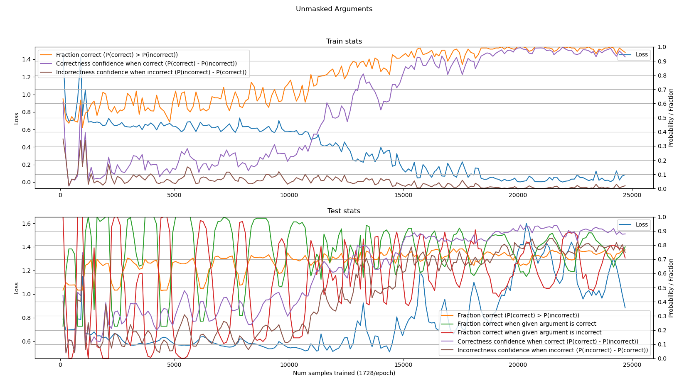
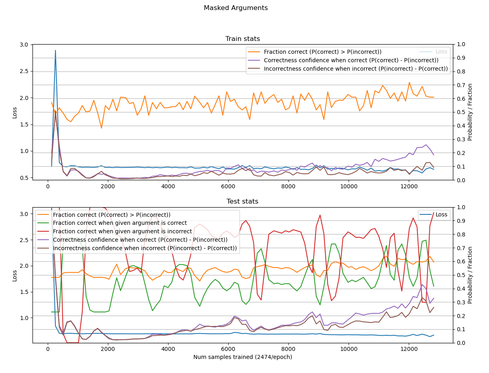
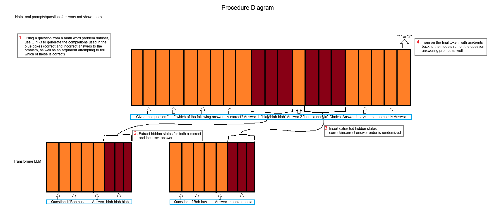

# Repository Structure
- main.py
    * contains code to finetune a modified Alpaca (7b param) language model on the given data
    * requires python packages: torch datasets transformers bitsandbytes numpy peft einops scipy flash-attn
    * note: installing flash-attn requires torch to be installed first
    * the workaround in accelerate-workaround.txt needs to be applied for this to run properly
- datagen-main.py
    * contains code to use GPT-3 to generate the dataset used in this project
    * requires python packages: datasets openai
- accelerate-workaround.txt
    * describes a hack that needs to be applied to the accelerate package in order for main.py to work
- huggingface/modeling_llama.py
    * a modification of the [LLaMA implementation](https://github.com/huggingface/transformers/blob/v4.30.1/src/transformers/models/llama/modeling_llama.py) used in the huggingface transformers package
    * modified to support the hidden state extraction and insertion used in this project ("transplant_dict")
    * flash attention is added per [llama_flash_attn_monkey_patch.py](https://github.com/lm-sys/FastChat/blob/bb027012fec66fa0b13b2dd7d8534d97c28f009e/fastchat/train/llama_flash_attn_monkey_patch.py)
    * the residual is changed to a 64 bit float
- data/dataset.csv
    * the data generated by running datagen-main.py

# About This Project
In this project I attempted to probe the inner workings of chain-of-thought reasoning in large language models, in particular I looked to test if a model generating a chain of thought could be tuned to detect the truth or falsity of the argument being made.

I found that a tuned 7b parameter Alpaca model was able to improve correct answer detection from 59% (GPT-3.5 generated response correctness rate) by up to 20% to 79% on the held-out test set, though these improvements are unstable and frequently dip 10-15% throughout training.

To run this project I used GPT-3.5 (text-davinci-003) and fine-tuned a LLaMA-based 7b parameter LLM using [runpod.io](runpod.io). For math word problems the AddSub, SingleOP, SVAMP, MultiArith, ASDiv, GSM8K, SinglEq, and SimulEq datasets are used as found in the [Lila benchmark](https://lila.apps.allenai.org/) dataset.

Experiments run on 1x RTX A6000 48GB for about 24 hours.

---

## Procedure
### Example of a generated datapoint:
```
- Question: Janet needs 5 tickets to ride the roller coaster and 3 tickets to ride the giant slide. How many tickets does she need to ride the roller coaster 7 times and the giant slide 4 times?
- Correct Answer: Janet needs 5 tickets to ride the roller coaster and 3 tickets to ride the giant slide. To ride the roller coaster 7 times, she needs 7 x 5 = 35 tickets. To ride the giant slide 4 times, she needs 4 x 3 = 12 tickets. Therefore, Janet needs 35 + 12 = 47 tickets.
- Incorrect Answer: Janet needs 5 tickets to ride the roller coaster once and 3 tickets to ride the giant slide once. Therefore, she needs 5 x 7 = 35 tickets to ride the roller coaster 7 times and 3 x 4 = 12 tickets to ride the giant slide 4 times. In total, she needs 35 + 12 = 58 tickets.
- Choice Argument: Candidate 1 provides a more accurate answer because it takes into account the fact that Janet needs 5 tickets to ride the roller coaster and 3 tickets to ride the giant slide each time. Candidate 2 does not take this into account and therefore provides an incorrect answer.
```

I used the following procedure to generate data and train the model for this project (also shown figure [Procedure Diagram](#procedure-diagram)):

1. Use GPT-3.5 (text-davinci-003) to generate a correct and an incorrect answer with explanations to a math word problem, and an argument attempting to choose which of the two explanations is correct.
1. Input the full question prompt + generated answer to an [Alpaca-7b](https://github.com/tloen/alpaca-lora/tree/main) model and extract the hidden states for the answer explanation tokens for both explanations
1. Input the full explanation choice prompt + generated choice argument to an Aplaca-7b model with the previously extracted answer explanation hidden states inserted over the model's hidden states for the explanation tokens.
1. Train the model on the last output token, which identifies which answer was chosen as the correct one.

The training curves for this are in figure [Unmasked Arguments](#unmasked-arguments-traintest-curves). The model oscillates between favouring the answer chosen by the input argument (from GPT-3.5, correct about 59% of the time) and the answer not chosen by the argument, then it starts overfitting the dataset after about 12000 samples trained. The test set has the given argument choose the correct answer 64% of the time, the model is able to improve on this with up to a 79% correctness rate at times, though this is very unstable and likely wouldn't generalize.

I attempted to mitigate the issue of oscillating between following and not following the given argument's answer by editing the arguments to replace the chosen answer identifier with an underscore. The results of this run can be seen in figure [Masked Arguments](#masked-arguments-traintest-curves). The model still oscillates between choosing in line with the given argument and choosing opposite of it, with the oscillations being somewhat less extreme. Here the performance on the test set at best matches the base rate of 64% correctness, though it is correct and incorrect on different questions than the arguments in the dataset. This indicates the model has learned to detect true arguments independently of what's written in the answer choice argument, however it is no better at doing so than GPT-3.5 with the prompts used.

---

## Limitations
The incorrect answers generated by GPT-3.5 often have correct arguments except for the last step which makes a "blatant" arithmetic error, as can be seen in the [example of a generated datapoint](#example-of-a-generated-datapoint) above. This is likely due to the different prompting strategy used to generate incorrect answers, where the model is made to output its final answer before its chain-of-thought argument (as opposed to argument first when trying to generate correct answers). As a result the model may be able to attain a high choice correctness rate by simply checking the last step of both arguments.

---

## Potential Future Steps
I would like to extend these tests to have random amounts of the argument tokens cut off the end to see how this affects answer prediction: is the final answer only apparent from the last few internal states, is it typically progressively built up over the course of the argument, or something else? It would also be interesting to re-run these tests with higher quality data, more powerful models, and a wider range of hyperparameters, in particular weight decay and a lower learning rate. As well it would be interesting to train the model adversarially, i.e. to train it to increase the probability of the final answer choice being its answer regardless of if it is correct, to test if the model run on the correct argument can learn a way to represent its correctness in a way that the answer chooser can verify and differentiate from the incorrect answer's hidden states.

---

### Unmasked Arguments Train/Test Curves


### Masked Arguments Train/Test Curves


### Procedure Diagram

